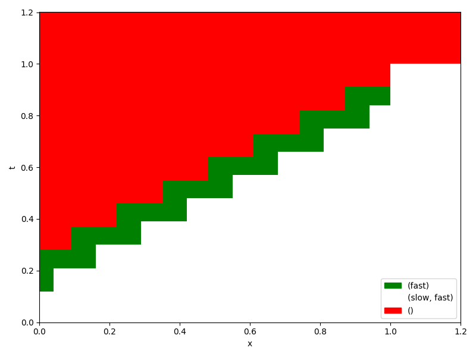

# Synthesize shields for safe control

Package designed to synthesize permissive shields for controllers of various
RL environments. Based on [Shielded Reinforcement Learning for Hybrid Systems][1]
which has a Julia-implementation [here][2].

## Usage

Instantiate an environment (some pre-build environments are supplied in 
`pyshield/envs.py`):

Then instantiate a shield with the environment, the granularity of the
discretization and the number of supporting points to sample per axis.

Synthesizing the shield is done via a call to
`shield.make_shield(verbosity=1)`. You can set `verbosity` to 0 if you don't want
any status output.

```python
from pyshield.models import Shield
from pyshield.envs import RandomWalk

# The parameter `unlucky` enforces a worst-case stochasticity on the environment
env = RandomWalk(obs_low=[0,0], obs_high=[1.2,1.2], unlucky)

shield = Shield(env, 0.005, samples_per_axis=4)
shield.make_shield(verbosity=1)
```

After this is done, `shield.safe_actions` store information on which actions are
safe in which partitions. If the environment is 2-dimensional, you can draw the
shield, if you provide the names of the actions, the axis labels and a colormap.

```python
# the names of action 0 and action 1
action_names = ['slow', 'fast']

# the colors of the partitions depending on allowed actions
cmap = { '()': 'r', '(slow)': 'y', '(fast)': 'g', '(slow, fast)': 'w' }

# labels of x and y axis
labels = ('x', 't')

shield.draw(cmap, axis_labels=labels, actions=acton_names)
```

For the example here, the output should look like this:



## Custom environments

Currently, two environments are supplied in `pyshield/envs.py`. You can use your
own environments if they implement the following API (largely inherited from
[Gymnasium][4]:

- They have an attribute `observation_space`, which should be a [Box][3] space
    with non-infinite bounds
- They have an attribute `action_space`, which should be a [Discrete][5] space
- They have a function called `is_safe(s)`, which takes a state `s` and returns
   `True` if `s` is a safe state and `False` otherwise
- They have a function called `allowed_actions(s)`, which takes a state `s` and
   returns a list of allowed actions in this state (can just be all states for
   any value of `s`)
- They have a function `step_from(s, a)`, which takes a state `s` and an action
   `a` and returns a tuple `(next_s, reward, terminated)` that comes from
   performing a single step from `s` by taking action `a`

[1]: https://arxiv.org/abs/2308.14424
[2]: https://github.com/AsgerHB/GridShielding.jl/tree/main/
[3]: https://gymnasium.farama.org/api/spaces/fundamental/#box
[4]: https://github.com/Farama-Foundation/Gymnasium
[5]: https://gymnasium.farama.org/api/spaces/fundamental/#discrete
